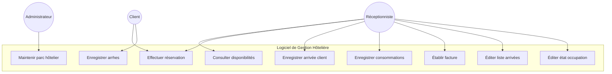
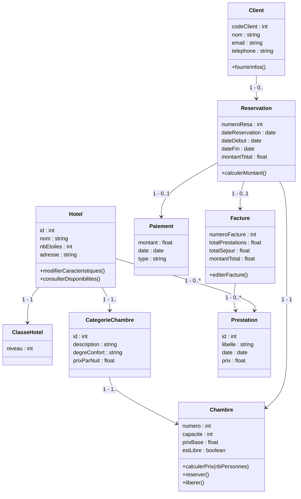
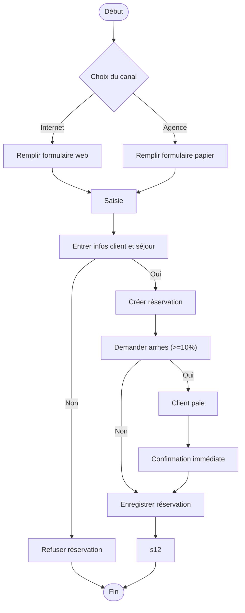
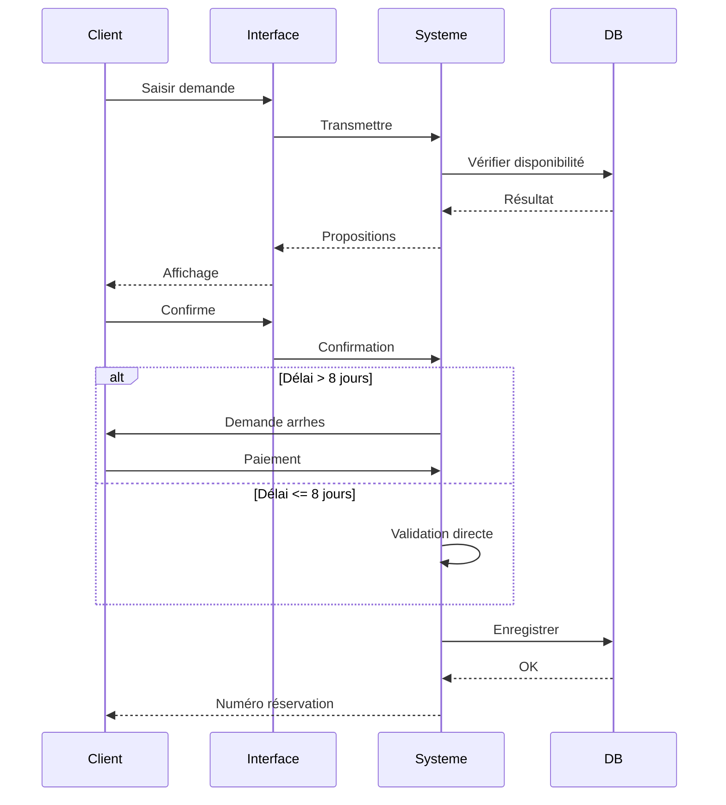

# Gestion Hôtelière - Diagrammes UML

---

## 1. Diagramme des Cas d'Utilisation

```mermaid
flowchart TD
    subgraph Systeme[Logiciel de Gestion Hôtelière]
        UC1[Maintenir parc hôtelier]
        UC2[Consulter disponibilités]
        UC3[Effectuer réservation]
        UC4[Enregistrer arrhes]
        UC5[Enregistrer arrivée client]
        UC6[Enregistrer consommations]
        UC7[Établir facture]
        UC8[Éditer liste arrivées]
        UC9[Éditer état occupation]
    end

    Client((Client))
    Receptionniste((Réceptionniste))
    Administrateur((Administrateur))

    Client --> UC3
    Client --> UC4

    Receptionniste --> UC2
    Receptionniste --> UC3
    Receptionniste --> UC5
    Receptionniste --> UC6
    Receptionniste --> UC7
    Receptionniste --> UC8
    Receptionniste --> UC9

    Administrateur --> UC1
```

---

## 2. Diagramme de Classes

```mermaid
classDiagram

class Hotel {
    id : int
    nom : string
    nbEtoiles : int
    adresse : string
    +modifierCaracteristiques()
    +consulterDisponibilites()
}

class ClasseHotel {
    niveau : int
}

class Chambre {
    numero : int
    capacite : int
    prixBase : float
    estLibre : boolean
    +calculerPrix(nbPersonnes)
    +reserver()
    +liberer()
}

class CategorieChambre {
    id : int
    description : string
    degreConfort : string
    prixParNuit : float
}

class Client {
    codeClient : int
    nom : string
    email : string
    telephone : string
    +fournirInfos()
}

class Reservation {
    numeroResa : int
    dateReservation : date
    dateDebut : date
    dateFin : date
    montantTotal : float
    +calculerMontant()
}

class Paiement {
    montant : float
    date : date
    type : string
}

class Facture {
    numeroFacture : int
    totalPrestations : float
    totalSejour : float
    montantTotal : float
    +editerFacture()
}

class Prestation {
    id : int
    libelle : string
    date : date
    prix : float
}

Hotel --> ClasseHotel : 1 - 1
Hotel --> CategorieChambre : 1 - 1..
CategorieChambre --> Chambre : 1 - 1..
Client --> Reservation : 1 - 0..
Reservation --> Chambre : 1 - 1
Reservation --> Paiement : 1 - 0..1
Reservation --> Facture : 1 - 0..1
Facture --> Prestation : 1 - 0..*
Hotel --> Prestation : 1 - 0..*
```

---

## 3. Diagramme d’Activité

```mermaid
flowchart TD
    Start([Début]) --> Choix{Choix du canal}

    Choix -->|Internet| FormWeb[Remplir formulaire web]
    Choix -->|Agence| FormPapier[Remplir formulaire papier]

    FormWeb --> Saisie
    FormPapier --> Saisie

    Saisie --> Dispo[Entrer infos client et séjour]

    Dispo -->|Non| Refus[Refuser réservation]
    Refus --> End([Fin])

    Dispo -->|Oui| Creation[Créer réservation]

    Creation --> Delai["Demander arrhes (>=10%)"]

    Delai -->|Oui| Arrhes[Client paie]
    Arrhes --> Paiement[Confirmation immédiate]

    Delai -->|Non| Confirmation[Enregistrer réservation]

    Paiement --> Confirmation
    Confirmation --> Enregistrement[s12]
    Enregistrement --> End
```

---

## 4. Diagramme de Séquence

```mermaid
sequenceDiagram
    participant Client
    participant Interface
    participant Systeme
    participant DB

    Client->>Interface: Saisir demande
    Interface->>Systeme: Transmettre

    Systeme->>DB: Vérifier disponibilité
    DB-->>Systeme: Résultat

    Systeme-->>Interface: Propositions
    Interface-->>Client: Affichage

    Client->>Interface: Confirme
    Interface->>Systeme: Confirmation

    alt Délai > 8 jours
        Systeme->>Client: Demande arrhes
        Client->>Systeme: Paiement
    else Délai <= 8 jours
        Systeme->>Systeme: Validation directe
    end

    Systeme->>DB: Enregistrer
    DB-->>Systeme: OK

    Systeme-->>Client: Numéro réservation
```
